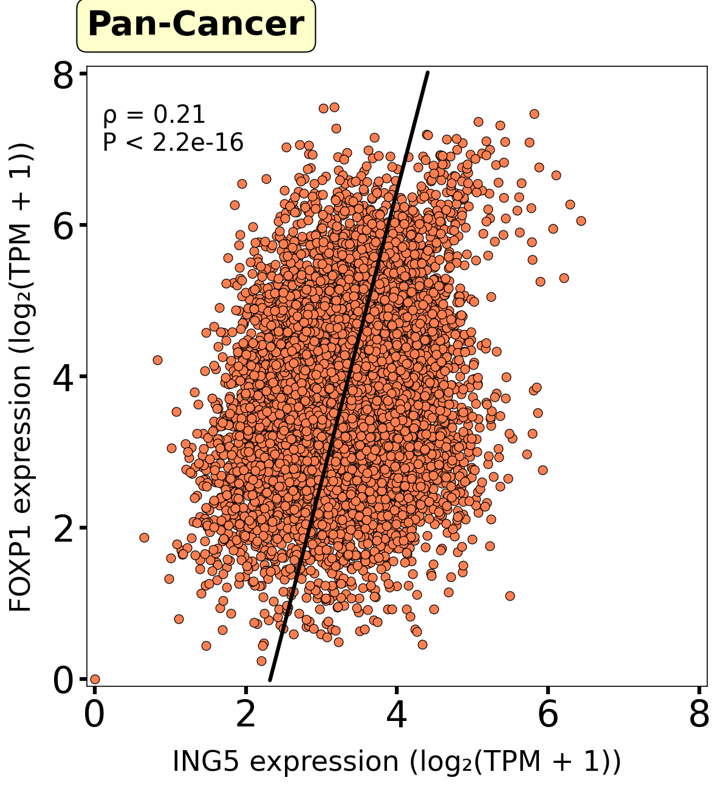
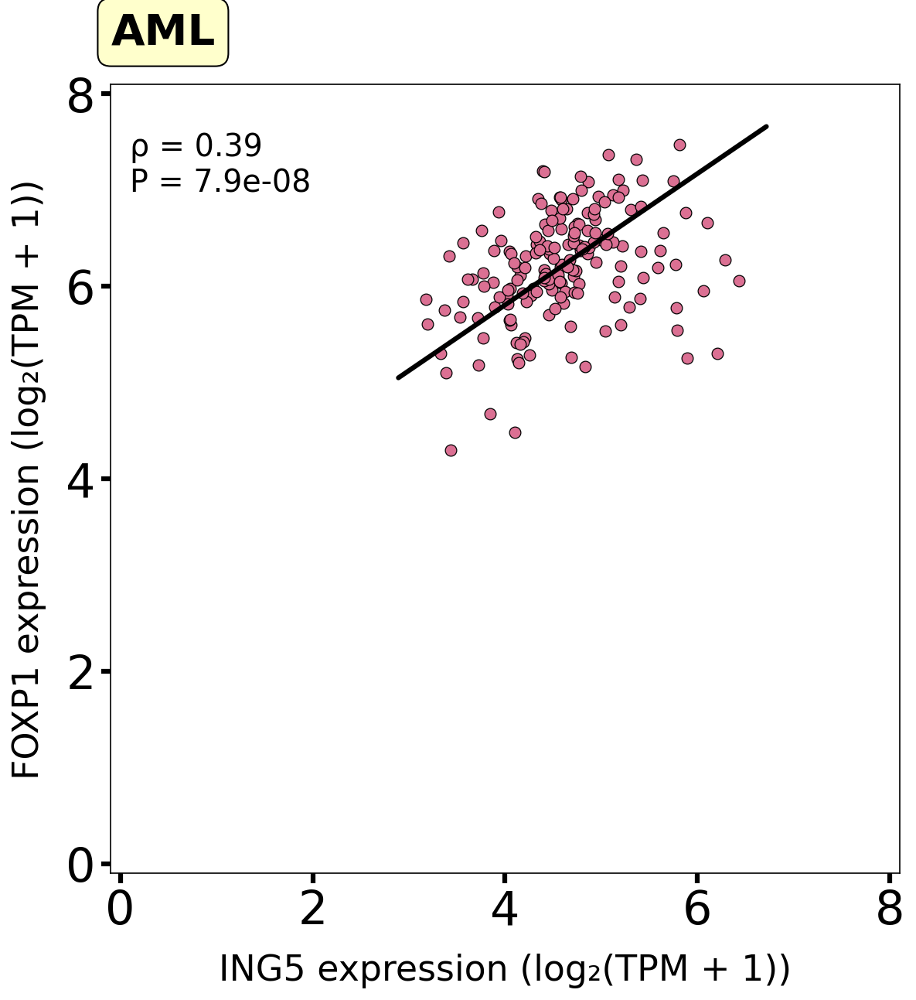
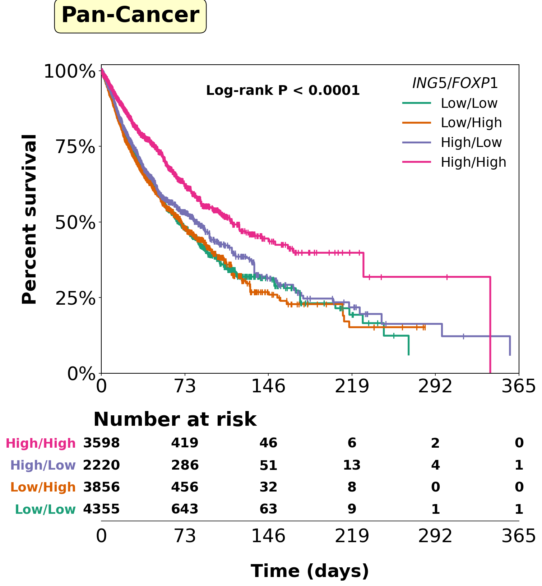
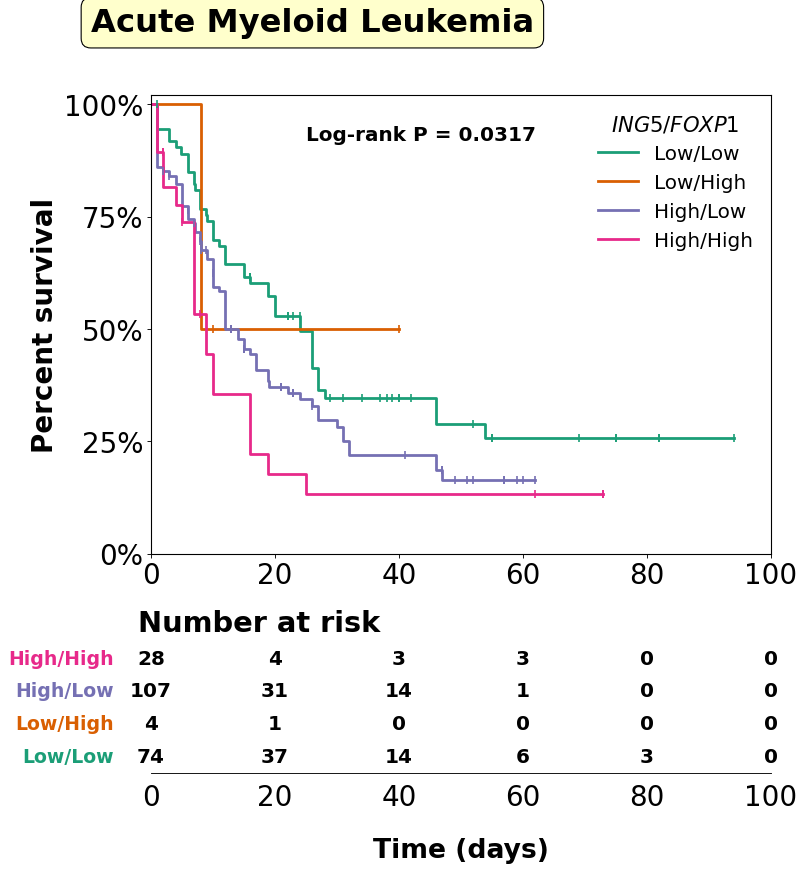
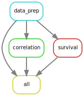

# TCGA Pan-Cancer Correlation and Survival Analysis Pipeline

A reproducible Python + Snakemake pipeline for analyzing gene expression correlations and survival outcomes across TCGA pan-cancer and AML cohorts. 

## Results

### Correlation Analysis (ING5 vs FOXP1)

Spearman rank correlation with Total Least Squares (orthogonal) regression, computed across 10,535 TCGA pan-cancer samples and 173 AML samples.

| | Pan-Cancer | AML |
|---|---|---|
| **Spearman ρ** | 0.21 | 0.39 |
| **P-value** | < 2.2e-16 | 7.9e-08 |

**Pan-Cancer (n = 10,535):** Weak but highly significant positive correlation. 


**AML (n = 173):** Moderate positive correlation within the AML cohort.


### Survival Analysis

Kaplan-Meier curves with optimally selected expression cutpoints (maximally selected rank statistics). Patients split into four groups based on High/Low expression of both genes.

**Pan-Cancer (n = 14,029):** Log-rank P < 0.0001


**AML (n = 213):** Log-rank P = 0.032


## Pipeline Overview

```
config.yaml
    ↓
01_data_prep.py    →  expression_clean.tsv + survival_clean.tsv
    ↓
02_correlation.py  →  scatter plots + correlation stats
    ↓
03_survival.py     →  Kaplan-Meier curves + risk tables
```

Orchestrated by Snakemake — run the full analysis with one command.

### DAG (Directed Acyclic Graph)



## Data Sources

| Dataset | Source | Description |
|---|---|---|
| Gene expression | [UCSC Xena TOIL Hub](https://xenabrowser.net/datapages/?dataset=tcga_RSEM_gene_tpm&host=https://toil.xenahubs.net) | TCGA RSEM gene TPM, log2(TPM+0.001), 60,498 genes × 10,535 samples |
| Clinical/survival | Included in repo (`data/TCGA_master_clinical_survival.csv`). Originally derived from the [TCGA Pan-Cancer Clinical Data Resource (Liu et al., 2018)](https://doi.org/10.1016/j.cell.2018.02.052) | Curated survival endpoints (OS, DSS, DFI, PFI) for 11,160 patients |

## Quick Start

### Prerequisites

- Python 3.10+
- Snakemake
- conda or mamba 

### Setup

```bash
# Clone the repository
git clone https://github.com/sda98/tcga-correlation-survival.git
cd tcga-correlation-survival

# Create conda environment
conda env create -f envs/environment.yaml
conda activate tcga-pipeline

# Run the full pipeline
snakemake --cores 1  # number of cores can be changed
```

The pipeline automatically downloads the expression data (~700 MB) on first run. Clinical survival data is included in the repository.

### Run individual steps

```bash
python scripts/01_data_prep.py      # Data download and preprocessing
python scripts/02_correlation.py    # Correlation analysis + scatter plots
python scripts/03_survival.py       # Survival analysis + KM curves
```

## Configuration

Edit `config.yaml` to analyze different gene pairs:

```yaml
gene1: "ING5"
gene2: "FOXP1"
split_method: "optimal"    # or "median"
```

## Methods

### Data Preprocessing
- Raw expression values converted from log2(TPM+0.001) to log2(TPM+1)
- Ensembl gene IDs mapped to HUGO symbols via MyGene.info API
- Negative values clipped to zero

### Correlation Analysis
- Spearman rank correlation (scipy.stats.spearmanr)
- Total Least Squares regression via Singular Value Decomposition (numpy.linalg.svd)
- Orthogonal regression minimizes perpendicular distances, appropriate when both variables have measurement error

### Survival Analysis
- Optimal expression cutpoints determined by maximally selected log-rank statistics (minprop = 0.1)
- Patients classified into four groups: High/High, High/Low, Low/High, Low/Low
- Kaplan-Meier survival curves with log-rank test for group comparison
- Risk tables showing number of patients at risk at each time point

## Project Structure

```
tcga-correlation-survival/
├── Snakefile                  # Workflow orchestration
├── config.yaml                # Analysis parameters
├── envs/
│   └── environment.yaml       # Conda environment specification
├── scripts/
│   ├── 01_data_prep.py        # Data download, TPM conversion, gene mapping
│   ├── 02_correlation.py      # Spearman correlation + TLS scatter plots
│   └── 03_survival.py         # Kaplan-Meier survival analysis
├── data/
│   └── TCGA_master_clinical_survival.csv
└── results/
    ├── expression_clean.tsv
    ├── correlation_pancancer.png
    ├── correlation_aml.png
    ├── survival_pancancer.png
    ├── survival_aml.png
    └── ING5_FOXP1_top.csv
```

## Dependencies

| Package | Purpose |
|---|---|
| pandas | Data manipulation |
| numpy | Numerical computation |
| scipy | Spearman correlation |
| matplotlib | Plotting |
| mygene | Ensembl to HUGO gene symbol mapping |
| lifelines | Kaplan-Meier survival analysis |
| snakemake | Workflow management |

## License

MIT

## Author

**Sergey Dadoyan, M.Sc.**  
Bioinformatician 
[LinkedIn](https://linkedin.com/in/sergeydadoyan) | [GitHub](https://github.com/sergeydadoyan)
