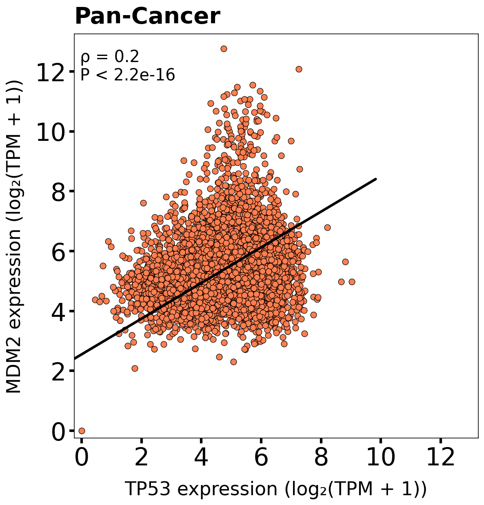
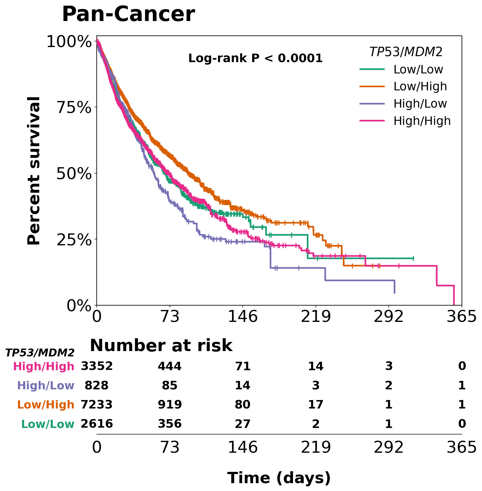
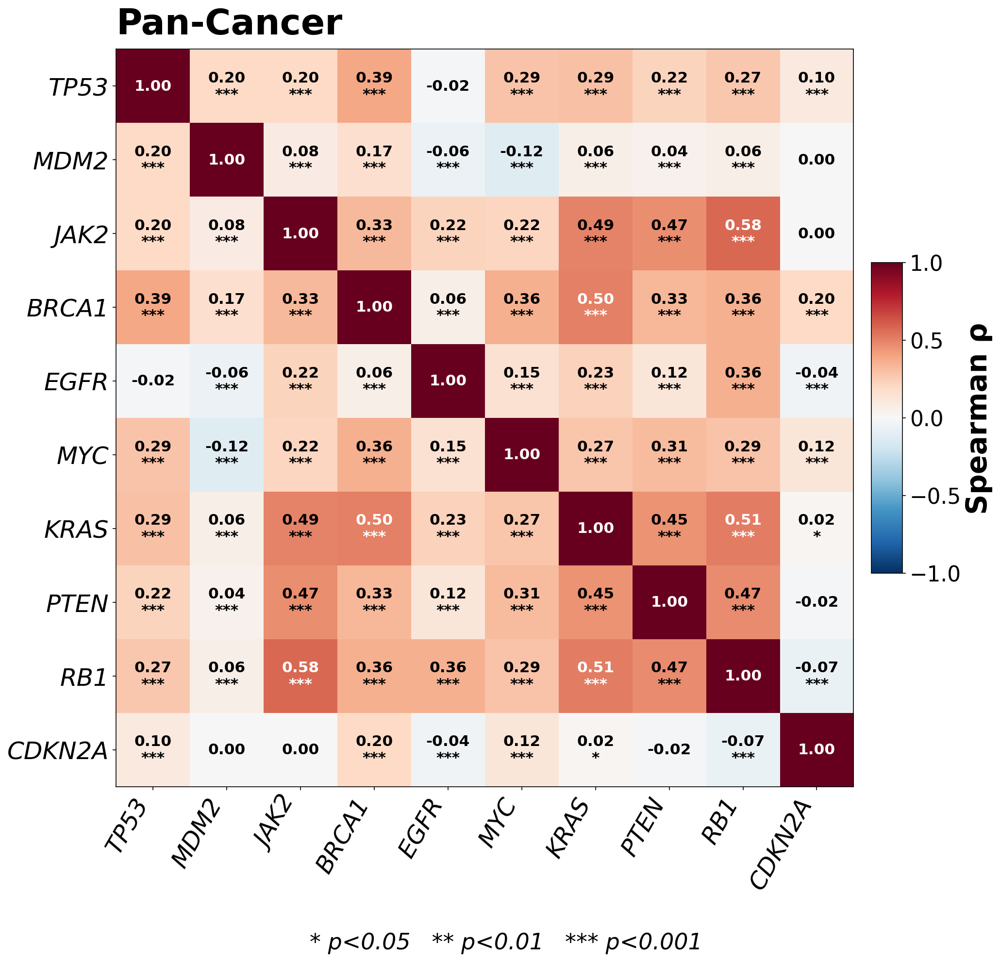
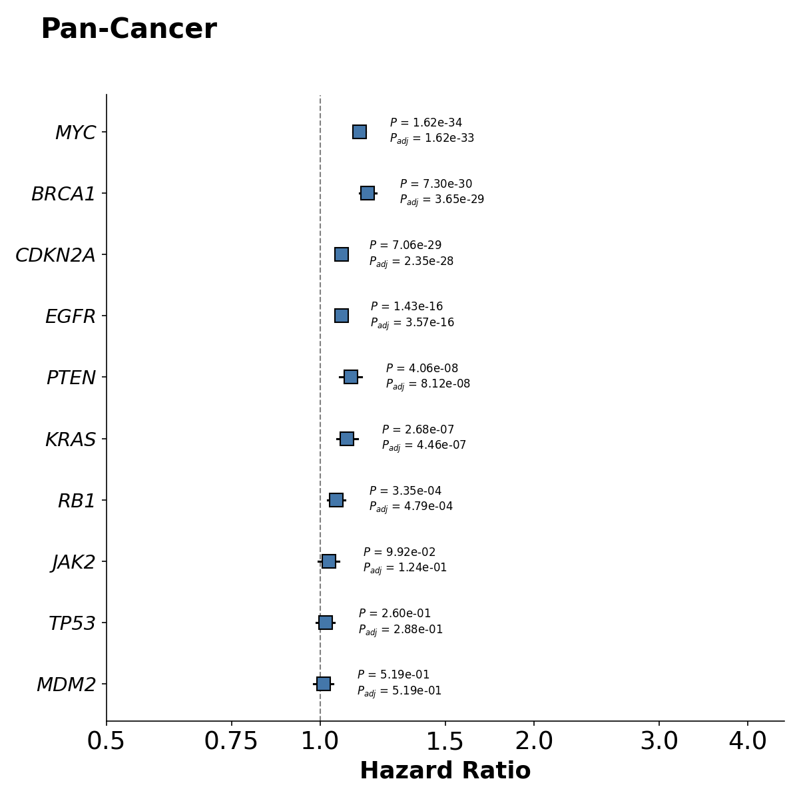

# TCGA Pan-Cancer Correlation and Survival Analysis Pipeline

  

A reproducible Snakemake pipeline for exploring gene co-expression and survival associations across TCGA pan-cancer and AML cohorts. Given any set of genes (2 or more), the pipeline produces correlation and survival analyses tailored to the input size.

## Motivation

Gene co-expression patterns and their association with patient survival are critical for cancer transcriptomics. TCGA provides one of the largest uniformly-processed pan-cancer expression datasets, but exploratory analyses typically require combining Python/R, and manual plotting. This pipeline aims to provide a single reproducible entry point: specify a set of genes, and receive publication-ready correlation and survival outputs for both pan-cancer and disease-specific (AML) contexts. The pipeline is intended for bioinformaticians, cancer researchers, and PIs who need quick hypothesis-generating outputs grounded in standard statistical methods.

## Table of Contents

- [Pipeline Overview](#pipeline-overview)
- [Two Analysis Modes](#two-analysis-modes)
- [Data Sources](#data-sources)
- [Quick Start](#quick-start)
- [Configuration](#configuration)
- [Methods](#methods)
- [Project Structure](#project-structure)
- [Dependencies](#dependencies)
- [Example Results](#example-results)
- [Limitations](#limitations)
- [References](#references)
- [License](#license)
- [Author](#author)

## Pipeline Overview

```
config.yaml + --config genes=X,Y,Z
    ↓
01_data_prep.py    →  expression_clean.tsv + survival_clean.tsv
    ↓
02_correlation.py  →  2 genes: scatter plot + TLS regression
                      3+ genes: pairwise Spearman heatmap
    ↓
03_survival.py     →  2 genes: Kaplan-Meier curves (4 combo groups) + log-rank test
                      3+ genes: univariate Cox regression + BH-FDR + forest plots
```

Orchestrated by Snakemake — run the full analysis with one command.

### DAG (Directed Acyclic Graph)


## Two Analysis Modes

The pipeline adapts its output based on the number of genes provided:

| Mode | Correlation step | Survival step |
|---|---|---|
| **2 genes** | Scatter plot with orthogonal (TLS) regression line and Spearman ρ | Kaplan-Meier curves for 4 combo groups (High/High, High/Low, Low/High, Low/Low) with log-rank test |
| **3+ genes** | Pairwise Spearman correlation heatmap with significance asterisks | Univariate Cox regression per gene + Benjamini-Hochberg FDR + forest plot (up to 20 genes); CSV-only output for >20 genes |

Each analysis runs on both pan-cancer (all samples) and AML (TCGA-AB-prefixed samples) cohorts.

## Data Sources

| Dataset | Source | Description |
|---|---|---|
| Gene expression | [UCSC Xena TOIL Hub](https://xenabrowser.net/datapages/?dataset=tcga_RSEM_gene_tpm&host=https://toil.xenahubs.net) | TCGA RSEM gene TPM, log₂(TPM+0.001), ~60,000 genes × ~10,500 samples |
| Clinical/survival | Included in repo (`data/TCGA_master_clinical_survival.csv`), derived from Liu et al. (2018) | Curated survival endpoints for ~11,000 patients |

## Quick Start

### Prerequisites

- Python 3.10+
- Snakemake
- conda or mamba

### Setup

```bash
# Clone the repository
git clone https://github.com/sda98/tcga-correlation-survival.git
cd tcga-correlation-survival

# Create conda environment
conda env create -f envs/environment.yaml
conda activate tcga-pipeline
```

The pipeline automatically downloads the expression data (~700 MB, gzipped) on first run. Clinical survival data is included in the repository.

### Running the Pipeline

Specify genes via `--config genes=` and choose how many you want:

```bash
# 2-gene analysis (scatter + KM curves)
snakemake --cores 5 --latency-wait 30 --config genes=TP53,MDM2

# 3+ gene analysis (heatmap + Cox forest plots)
snakemake --cores 5 --latency-wait 30 --config genes=TP53,MDM2,JAK2

# Larger screens work too (up to 20 genes for forest plot; CSV-only beyond that)
snakemake --cores 5 --latency-wait 30 --config genes=TP53,MDM2,JAK2,BRCA1,EGFR,MYC,KRAS,PTEN,RB1,CDKN2A
```

### Running Individual Steps

```bash
python scripts/01_data_prep.py
python scripts/02_correlation.py --genes TP53,MDM2
python scripts/03_survival.py --genes TP53,MDM2
```

## Configuration

Edit `config.yaml` for plot and cohort settings:

```yaml
aml_prefix: "TCGA-AB"        # sample ID prefix for AML cohort
split_method: "optimal"      # "optimal" or "median" for survival cutpoints
pancancer_xlim_days: 365     # KM plot x-axis range
aml_xlim_days: 100
```

Gene selection is command-line only (`--config genes=...`), not in `config.yaml`.

## Methods

### Data Preprocessing
- Raw expression values converted from log₂(TPM+0.001) to log₂(TPM+1)
- Ensembl gene IDs mapped to HUGO symbols via MyGene.info API
- Negative values clipped to zero

### Correlation Analysis
- **Spearman rank correlation** for all pairs (Spearman, 1904; via `scipy.stats.spearmanr`)
- **2-gene**: Total Least Squares regression via Singular Value Decomposition (`numpy.linalg.svd`) — minimizes perpendicular distances, appropriate when both variables carry measurement error
- **3+ genes**: Pairwise Spearman heatmap annotated with significance (\*\*\* p<0.001, \*\* p<0.01, \* p<0.05)

### Survival Analysis
- **2-gene**: Patients split High/Low per gene (median or optimally selected cutpoints via maximally selected rank statistics), creating 4 combo groups. Kaplan-Meier curves (Kaplan & Meier, 1958) compared with the log-rank test (Mantel, 1966).
- **3+ genes**: Univariate Cox proportional hazards regression (Cox, 1972) per gene using continuous expression as predictor. Benjamini-Hochberg FDR correction (Benjamini & Hochberg, 1995) applied across the gene set. Groups or cohorts with fewer than 10 events flagged as underpowered, following the 10 events-per-variable convention (Peduzzi et al., 1995). Output: per-gene hazard ratios with 95% CI, Wald p-values, and BH-adjusted p-values — displayed as a forest plot plus a CSV table that additionally reports β coefficients, standard errors, and event counts.

## Project Structure

```
tcga-correlation-survival/
├── Snakefile                  # Workflow orchestration
├── config.yaml                # Plot and cohort parameters
├── envs/
│   └── environment.yaml       # Conda environment specification
├── scripts/
│   ├── 01_data_prep.py        # Data download, TPM conversion, gene mapping
│   ├── 02_correlation.py      # Correlation analysis (scatter or heatmap)
│   └── 03_survival.py         # Survival analysis (KM or Cox+FDR)
├── data/
│   └── TCGA_master_clinical_survival.csv
└── results/
    ├── expression_clean.tsv
    ├── correlation_scatter_{pancancer,aml}.png     # 2-gene mode
    ├── correlation_heatmap_{pancancer,aml}.png     # 3+ gene mode
    ├── survival_km_{pancancer,aml}.png             # 2-gene mode
    ├── survival_cox_{pancancer,aml}.png            # 3+ gene mode
    └── survival_cox_{pancancer,aml}.csv            # 3+ gene mode
```

## Dependencies

| Package | Purpose |
|---|---|
| pandas | Data manipulation |
| numpy | Numerical computation |
| scipy | Spearman correlation |
| matplotlib | Plotting |
| mygene | Ensembl to HUGO gene symbol mapping |
| lifelines | Kaplan-Meier and Cox regression |
| statsmodels | BH-FDR multiple testing correction |
| snakemake | Workflow management |

## Example Results

The pipeline adapts its outputs based on input size. Below are example runs demonstrating both modes.

### 2-gene Mode: TP53 vs MDM2

*TP53 and MDM2 form a well-characterized negative feedback loop: MDM2 ubiquitinates TP53 for degradation, while TP53 transcriptionally activates MDM2.*

**Pan-Cancer correlation (n = 10,535)**



**Pan-Cancer survival (n = 14,029)**



### Multi-gene Mode: 10-gene Cancer Driver Panel

*TP53, MDM2, JAK2, BRCA1, EGFR, MYC, KRAS, PTEN, RB1, CDKN2A — a mix of tumor suppressors (TP53, BRCA1, PTEN, RB1, CDKN2A), oncogenes (MYC, KRAS, EGFR), and pathway regulators (MDM2, JAK2).*

**Pan-Cancer correlation heatmap**



**Pan-Cancer Cox forest plot**

Per-gene univariate hazard ratios with 95% confidence intervals, Wald p-values, and Benjamini-Hochberg adjusted p-values. The full table including β coefficients, standard errors, and per-cohort event counts is in [`results/survival_cox_pancancer.csv`](results/survival_cox_pancancer.csv).



## Limitations

- **Univariate Cox only.** The 3+ gene mode fits one Cox model per gene independently, without adjusting for clinical covariates (stage, age, etc.) or for correlations between genes. A multivariable Cox branch may be added in a future release.
- **No external validation cohorts.** Results are derived entirely from TCGA. External validation (e.g., CPTAC, GTEx, ICGC) is not currently integrated.
- **Expression data only.** Somatic mutations, copy-number alterations, and methylation are not incorporated.
- **Fixed endpoint.** Overall survival (OS) is used; other endpoints (DFS, PFS, DSS) are available in the clinical table but not exposed as pipeline outputs.
- **Download requirement.** First run downloads ~700 MB of gzipped expression data from UCSC Xena.

## References

Benjamini, Y., & Hochberg, Y. (1995). Controlling the false discovery rate: a practical and powerful approach to multiple testing. *Journal of the Royal Statistical Society: Series B (Methodological), 57*(1), 289–300.

Cox, D. R. (1972). Regression models and life-tables. *Journal of the Royal Statistical Society: Series B (Methodological), 34*(2), 187–202.

Goldman, M. J., Craft, B., Hastie, M., Repečka, K., McDade, F., Kamath, A., Banerjee, A., Luo, Y., Rogers, D., Brooks, A. N., Zhu, J., & Haussler, D. (2020). Visualizing and interpreting cancer genomics data via the Xena platform. *Nature Biotechnology, 38*(6), 675–678.

Kaplan, E. L., & Meier, P. (1958). Nonparametric estimation from incomplete observations. *Journal of the American Statistical Association, 53*(282), 457–481.

Liu, J., Lichtenberg, T., Hoadley, K. A., Poisson, L. M., Lazar, A. J., Cherniack, A. D., Kovatich, A. J., Benz, C. C., Levine, D. A., Lee, A. V., Omberg, L., Wolf, D. M., Shriver, C. D., Thorsson, V., & Hu, H. (2018). An integrated TCGA pan-cancer clinical data resource to drive high-quality survival outcome analytics. *Cell, 173*(2), 400–416.e11.

Mantel, N. (1966). Evaluation of survival data and two new rank order statistics arising in its consideration. *Cancer Chemotherapy Reports, 50*(3), 163–170.

Peduzzi, P., Concato, J., Feinstein, A. R., & Holford, T. R. (1995). Importance of events per independent variable in proportional hazards regression analysis. II. Accuracy and precision of regression estimates. *Journal of Clinical Epidemiology, 48*(12), 1503–1510.

Spearman, C. (1904). The proof and measurement of association between two things. *The American Journal of Psychology, 15*(1), 72–101.

## License

MIT

## Author

**Sergey Dadoyan, M.Sc.**  
Bioinformatician  
[LinkedIn](https://linkedin.com/in/sergeydadoyan) | [GitHub](https://github.com/sergeydadoyan)

